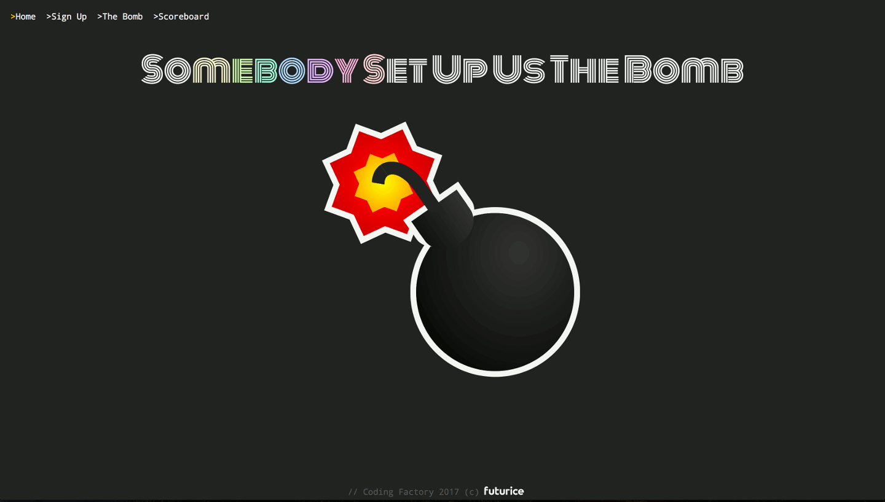
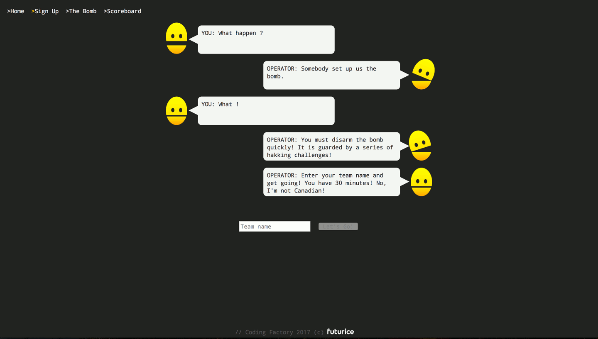
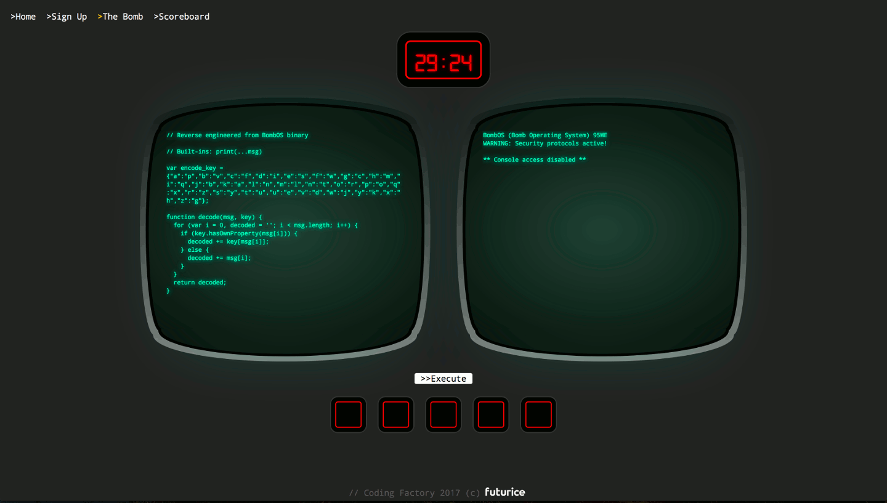
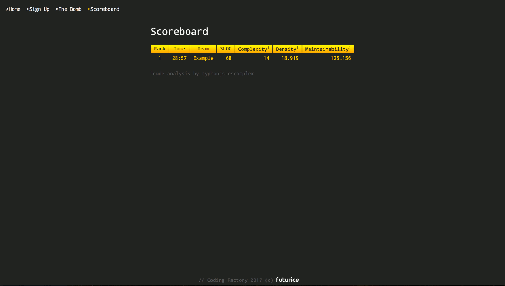

# coding-factory-2017

Futurice game app for aTalent Coding Factory 2017.

**Prerequisites**

* Node.js v8.17.0

**Running**

* Run `npm install`
* Run `npm start`

Once the server has started, navigate to `http://localhost:8000/`

Note that all data is stored in local storage. The dev server simply serves the static assets.

See https://github.com/philbooth/escomplex#metrics for info on the static analysis metrics.

